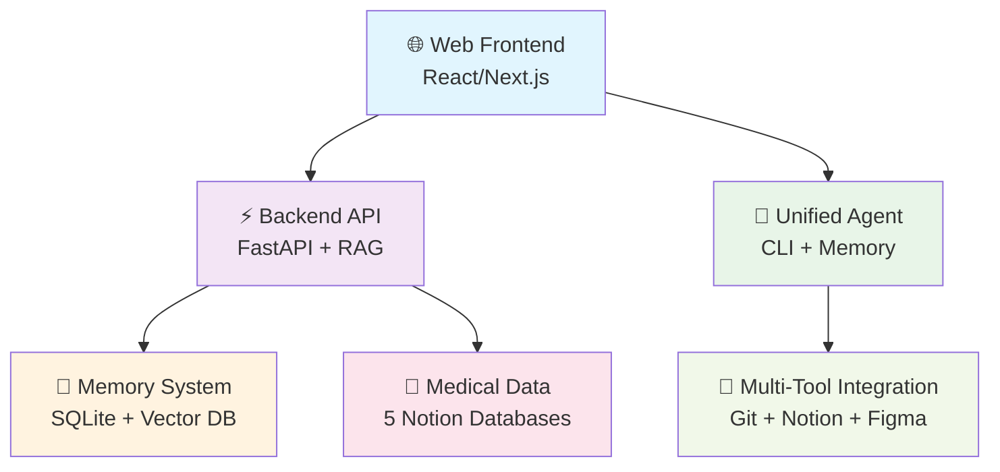

# 🚀 Beth's Sophisticated AI Assistant System

## 🌟 **Live Production App**
**https://beth-personal-assistant.web.app**

A comprehensive AI-powered personal assistant featuring advanced RAG (Retrieval Augmented Generation), medical data processing, and cross-tool intelligence.

---

## 🏗️ **System Architecture**



---

## ✨ **Key Features**

### 🌐 **Sophisticated Web Interface**
- **Advanced Chat System**: Real conversation memory and context tracking
- **Figma Design System**: Complete design token integration
- **Dynamic Suggestions**: Context-aware intelligent suggestions
- **Offline Capability**: Smart fallback with personalized responses
- **Responsive Design**: Works on all devices

### 🧠 **RAG-Powered Intelligence**
- **Retrieval Augmented Generation**: Learn from conversations
- **Memory Persistence**: SQLite database with conversation history
- **Contextual Responses**: Answers based on your complete history
- **Cross-Reference Intelligence**: Connects information across tools

### 🏥 **Medical Data Processing**
- **5 Notion Databases**: Medical Calendar, Symptoms, Team, Medications, Notes
- **PDF Text Extraction**: Automatic medical record processing
- **AI Entity Recognition**: Smart medical information extraction
- **Timeline Generation**: Chronological health journey tracking

### 🤖 **Unified Personal Agent**
- **Daily Dashboard**: Actionable insights across all your tools
- **Git Repository Tracking**: Monitor all development projects
- **Cross-Tool Intelligence**: Notion + GitHub + Figma integration
- **Smart Capture**: AI-powered information categorization

---

## 🚀 **Quick Start**

### **Use the Web App** (Recommended)
Visit **https://beth-personal-assistant.web.app** and start chatting!

### **Local Development**
```bash
# Clone the repository
git clone https://github.com/BethCNC/my_assistant.git
cd my_assistant

# Start web app
npm run dev

# Start health journey app  
npm run dev:health

# Use unified agent
python beth_unified_agent.py daily
```

### **Desktop App**
```bash
# Run as Electron desktop app
npm run dev:desktop
```

---

## 📁 **Project Structure**

```
my_assistant/
├── 🌐 frontend/                    # React/Next.js web interface
│   ├── components/                 # UI components with Figma design system
│   ├── app/                       # Next.js app router pages
│   └── lib/                       # Utilities and API clients
├── ⚡ backend/                     # FastAPI backend with RAG
│   ├── main.py                    # API server with chat endpoints
│   ├── rag_service.py             # RAG implementation
│   └── agent_memory.db            # SQLite conversation database
├── 🏥 beth_health_journey_app/     # Medical data processing
│   ├── scripts/                   # Medical data import/processing
│   └── data/                      # Medical records and summaries
├── 🤖 beth_unified_agent.py        # Unified personal agent CLI
├── 📊 medical-data-analysis/       # Advanced medical analytics
└── 📚 Documentation/               # Comprehensive guides
```

---

## 🔧 **Available Commands**

### **Development**
```bash
npm run dev                    # Start web app (localhost:3000)
npm run dev:health            # Start health journey app  
npm run dev:desktop           # Run as desktop app
```

### **Production Deployment**
```bash
npm run build                 # Build all apps
npm run deploy:all           # Deploy everything to production
npm run deploy:web           # Deploy web app to Firebase
npm run deploy:backend       # Deploy backend to Google Cloud
```

### **Unified Agent**
```bash
python beth_unified_agent.py daily     # Daily dashboard
python beth_unified_agent.py ask "..."  # Ask AI advisor
python beth_unified_agent.py capture   # Smart capture
python beth_unified_agent.py git-status # All repo status
```

---

## 🛠️ **Technology Stack**

### **Frontend**
- **React 18** with Next.js 15 App Router
- **TypeScript** for type safety
- **Tailwind CSS** with custom design tokens
- **Figma Design System** integration

### **Backend**
- **FastAPI** for high-performance API
- **RAG (Retrieval Augmented Generation)** with vector search
- **SQLite** for conversation memory
- **OpenAI API** for AI responses

### **Infrastructure**
- **Firebase Hosting** for web app
- **Google Cloud Run** for backend
- **Notion API** for medical data
- **GitHub API** for repository tracking

### **Desktop**
- **Electron** for cross-platform desktop app

---

## 🏥 **Medical Data Integration**

### **Notion Databases**
1. **Medical Calendar** - Appointments, tests, procedures
2. **Symptoms** - Tracking and correlation
3. **Medical Team** - Providers and specialists  
4. **Medications** - Prescriptions and effectiveness
5. **Notes** - Research, documents, insights

### **Processing Pipeline**
- **PDF Text Extraction** from medical records
- **AI Entity Recognition** for medical terms
- **Automatic Data Structuring** into Notion
- **Timeline Generation** for health journey

---

## 🔐 **Security & Privacy**

- **Secure Authentication** with organization policies
- **Environment Variables** for sensitive data
- **Database Encryption** for medical information
- **HIPAA-Compliant** data handling practices

---

## 🌟 **What Makes This Special**

### **🧠 True Intelligence**
Unlike simple chatbots, this system learns from your conversations, references your medical history, tracks your projects, and provides insights across all your tools.

### **🏥 Medical Focus**
Specifically designed for managing complex health journeys with multiple conditions, treatments, and healthcare providers.

### **🎨 Design Excellence**
Built with a complete Figma design system, ensuring beautiful, consistent, and accessible user experience.

### **🔗 Unified Experience**
One system that understands your Git repositories, Notion databases, medical records, and provides intelligent insights across everything.

---

## 📈 **Current Status**

- ✅ **Web App**: Live in production
- ✅ **Backend**: Deployed with RAG and memory
- ✅ **Medical Processing**: 5 databases integrated  
- ✅ **Unified Agent**: Full cross-tool intelligence
- ✅ **Desktop App**: Electron wrapper ready
- ✅ **Documentation**: Comprehensive guides

---

## 🤝 **Contributing**

This is a personal AI assistant system, but the architecture and patterns can be useful for similar projects.

---

## 📝 **License**

Personal project - All rights reserved

---

## 🔗 **Links**

- **Live App**: https://beth-personal-assistant.web.app
- **Firebase Console**: https://console.firebase.google.com/project/beth-personal-assistant
- **Documentation**: See `/PRODUCTION_DEPLOYMENT.md` for detailed setup

---

*Built with ❤️ by Beth for managing complex health journeys and personal productivity* 